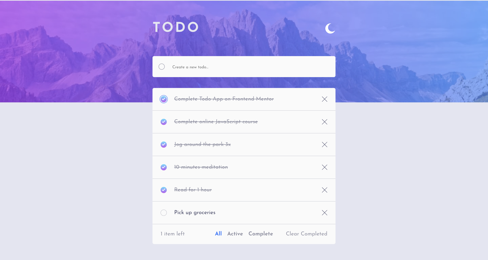

# Frontend Mentor - Todo app solution

This is a solution to the [Todo app challenge on Frontend Mentor](https://www.frontendmentor.io/challenges/todo-app-Su1_KokOW). Frontend Mentor challenges help you improve your coding skills by building realistic projects.

## Table of contents

- [Overview](#overview)
  - [The challenge](#the-challenge)
  - [Screenshot](#screenshot)
  - [Links](#links)
- [My process](#my-process)
  - [Built with](#built-with)
  - [Useful resources](#useful-resources)
- [Author](#author)

**Note: Delete this note and update the table of contents based on what sections you keep.**

## Overview

### The challenge

Users should be able to:

- View the optimal layout for the app depending on their device's screen size
- See hover states for all interactive elements on the page
- Add new todos to the list
- Mark todos as complete
- Delete todos from the list
- Filter by all/active/complete todos
- Clear all completed todos
- Toggle light and dark mode
- **Bonus**: Drag and drop to reorder items on the list

### Screenshot

### Links

- Solution URL: [https://www.frontendmentor.io/solutions/todo-app-built-using-reactjs-0MzFDka6jJ](https://www.frontendmentor.io/solutions/todo-app-built-using-reactjs-0MzFDka6jJ)
- Live Site URL: [https://todo-app-lilac-three.vercel.app/](https://todo-app-lilac-three.vercel.app)

## My process

### Built with

- Semantic HTML5 markup
- CSS custom properties
- Flexbox
- CSS Grid
- Mobile-first workflow
- [React](https://reactjs.org/) - JS library

### Useful resources

- [Pure CSS Custom Checkbox Style](https://moderncss.dev/pure-css-custom-checkbox-style/) - This article helped me to custom style the checkbox and also make it accessible.

## Author

- Frontend Mentor - [@theadusamuel](https://www.frontendmentor.io/profile/theadusamuel)
